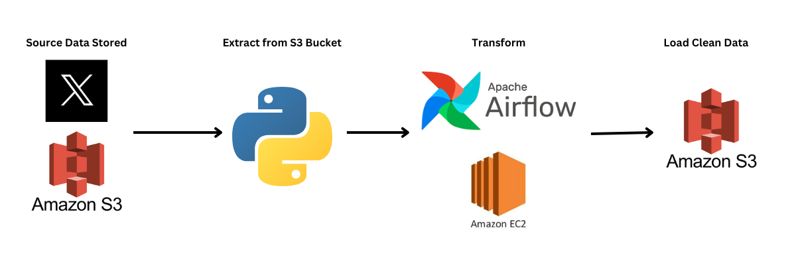

#  Twitter Data Pipeline with Airflow

### Main Objective

Automating the process of collecting, processing, and storing twitter clean data into Amazon S3 bucket, in order to use it for data analysis. We will be using Apache Airflow management tool to create and manage data pipeline.

#### Data Pipeline Architecture

